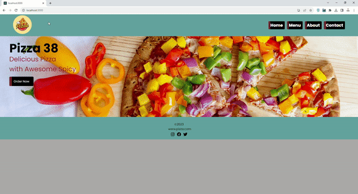

# Pizza Restaurant Website

## Table of Contents
- [Overview](#overview)
- [Technologies Used](#technologies-used)
- [Project Structure](#project-structure)
- [How to Run](#how-to-run)
- [Usage](#usage)
- [License](#license)
- [Contact](#contact)

## Screen

## Overview
This is a React-based web application for a pizza restaurant. It allows customers to view the restaurant's menu, learn about the restaurant, and contact the restaurant for inquiries. The project is structured as follows:

## Technologies Used
- **React**: This project is built using React, a popular JavaScript library for building user interfaces.
- **React Router**: React Router is used for handling client-side routing, enabling navigation between different pages of the application without a full page reload.
- **CSS**: Cascading Style Sheets are used for styling the application, and the project includes a CSS file (App.css) for defining the overall styles.

## Project Structure
- **Navbar**: A navigation bar component (Navbar.jsx) is used to provide easy navigation between different sections of the website.
- **Pages**: The application has several pages, including:
  - **Home**: The landing page that displays a welcome message and some featured content.
  - **Menu**: A page displaying the restaurant's menu items with images and prices.
  - **About**: A page providing information about the restaurant.
  - **Contact**: A page allowing users to send inquiries or messages to the restaurant.
- **Footer**: A footer component (Footer.jsx) is included at the bottom of each page to provide additional information and links.
- **Assets**: The project includes image assets for menu items (pizza1.jpg, pizza2.jpg, etc.) stored in the assets directory.
- **Data**: The menu items are defined in a data file (MenuList.js) as an array of objects, each containing the name, image, and price of a pizza.

## How to Run
1. Clone this repository to your local machine.
2. Navigate to the project directory in your terminal.
3. Install the required dependencies using `npm install`.
4. Start the development server with `npm start`.
5. Open your web browser and visit `http://localhost:3000` to view the application.

## Usage
Feel free to use this project as a template for your own restaurant website or as a starting point for your React-based web application. Customize the menu items, images, and content to suit your needs.

## Contact
If you have any questions or feedback, please don't hesitate to [contact us](mailto:advocate.ilker@gmail.com).
